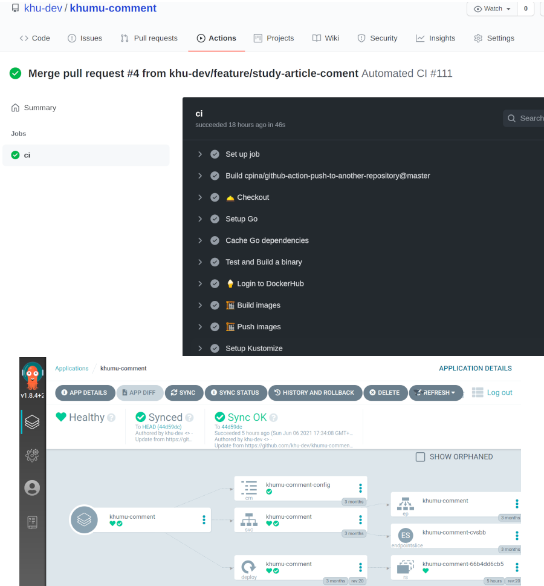
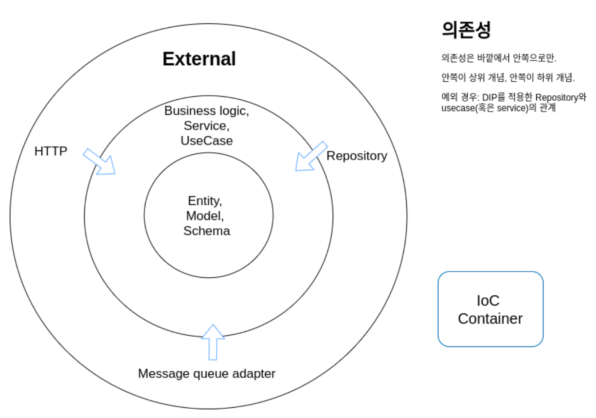

# KHUMU Comment API Server

**khumu-comment**는 MSA로 개발중인 khumu의 comment 관련 API를 제공하는 서버이며 `Echo` 라는 Golang의 웹 프레임워크를 바탕으로 개발되고 있다. 주로 사용되는 개발 방법론은 TDD이며 Clean architecture를 바탕으로 개발을 진행 중이다.

API Documentation: https://documenter.getpostman.com/view/13384984/TVsvfkxs

## ⚙️ 설정하는 방법

설정 파일 적용은 Go의 유명한 설정 관리 라이브러리인 [spf13/viper](https://github.com/spf13/viper)을 쿠뮤 서비스에서 좀 더 편리하게 사용하기 위해 한 번 래핑한 [umi0410/ezconfig](https://github.com/umi0410/ezconfig)를 이용한다. 기본적으로는 `config/default.yaml`을 이용하며 필요에 따라 `KHUMU_` prefix가 붙은 환경 변수를 통해 override할 수도 있고 `config/{{KHUMU_ENVIRONMENT}}.yaml`의 설정파일로 override할 수 있다. 자세한 사항은 [umi0410/ezconfig](https://github.com/umi0410/ezconfig)에서 확인해볼 수 있다.

**`KHUMU_CONFIG_PATH` 환경변수를 통해 `config` 이외의 config file이 위치한 path를 설정**할 수 있다. 단순히 `config`라는 상대 경로만을 이용하면 간혹 test code를 진행하는 과정에 test code를 실행하는 위치에 따라 working directory가 달라지면서 올바르게 config 파일들을 찾지 못하는 경우가 있기 때문이다.

(설정 예시: `KHUMU_CONFIG_PATH=/home/jinsu/khumu-comments/config`)

### 환경 변수 설정

* `KHUMU_SECRET`: 환경변수를 통해 jwt를 verify할 secret을 설정한다.
* `KHUMU_CONFIG_PATH` : 상대 경로 `config` 이외의 경로에서 config file을 찾을 수 있도록 한다.
* 추가적으로 `KHUMU_` prefix를 통해 환경 변수로 Config의 필드들을 오버라이드 할 수 있다.

## 🐎 배포 (CI/CD)



1. 현재는 Github Action에서 매 푸시마다 전체 unit test를 진행
2. 테스트 모두 통과 시 docker image 빌드 후 새로 빌드된 이미지 태그를 private repository로 관리되는 `khu-dev/devops` 레포지토리에 반영
3. `ArgoCD` 를 통해 자동 배포하며 이때 `kustomize`를 통해 새 이미지 태그가 적용됨

## 💯 테스트를 진행하는 방법

### 프로젝트 내의 모든 유닛 테스트

```bash
# 프로젝트의 루트 경로에서
$ go test ./...
# 혹은 자세한 로그를 보고싶다면
$ go test ./... -v
# 혹은 간단히
$ make test
```

### TDD 식의 개발 방법 - 선 유닛 테스트 작성. 후 개발/리팩토링 

> test는 MySQL이 아닌 SQLite3를 메모리를 바탕으로 간단하게 이용한다.
>
> **TODO: Service layer 테스트 시에는 Repository layer나 외부 모듈들을 Mocking하여 유닛 테스트 진행하기**. 기존에는 비즈니스 로직을 테스트할 때에도 SQLite3과 DAO를 이용해 영속화까지 진행하는 통합 테스트 같은 형태로 진행했으나
> 테스트가 DAO에 대한 의존성을 갖다보니 불필요한 초기 데이터들을 생성해줘야하는 불편이 있었고 이로 인해 많은 테스트 케이스를 작성하는 데에 불편을 느낌  

* 개발할 기능에 대한 최소한의 기능과 사용하고자하는 타입, 네이밍등을 미리 `xxx_test.go` 파일에 작성한다.
* 해당 기능을 `xxx.go` 에서 구현한다.
* 구현해나가면서 아래의 커맨드 코드를 통해 새로 구현하는 내용에 대해서만 간단히 테스트 해본다.
* 구현이 끝나면 전체 유닛 테스트를 실행해보고, 좀 더 나은 방향으로 리팩토링한다.
* 리팩토링이 완료되면 다시 새로운 기능에 대해 유닛테스트를 작성한다.

이렇게 새로 구현할 내용에 대한 유닛테스트를 통해 개발을 진행하면 전체 서버를 재실행하면서
같은 작업을 반복적으로 수행하는 불편을 없앨 수 있고, 한 기능에 대한 전체 계층을 구현하지 않아도
개발하는 동안 각 계층별로 미리 테스트가 가능하다.

**e.g.** _TDD 방식을 이용하지 않고 개발하면 우선 `repository` 계층만 미리 구현하고 테스트하고 싶은데, http 계층
까지 다 구현한 뒤 서버를 띄우고 그 엔드포인트에 요청을 보내고 로그를 관찰하며 개발을 해야하지만, TDD와 Unit test를
이용해 개발하면 unit test의 결과만 보고도 개발이 가능하다._

```bash
# 개발 중인 파일이 속한 패키지의 경로에 대해 실행하고자하는 함수명을 전달한다.
# 이때 TestSetUp에서 Initialize 관련한 내용도 테스트하도록 설계했기때문에 TestSetUp도 같이 전달한다.
$ go test ./repository/ -run TestSetUp TestLikeCommentRepositoryGorm_Create -v
```


## 📚 개발 팁 및 메모

* go test 대신 [gotest](https://github.com/rakyll/gotest)를 이용하면 좀 더 가시성 좋게 test를 진행할 수 있다.
* Jetbrains사의 GoLand를 이용하면 IDE에서 좀 더 편리하게 원하는 unit test를 실행할 수 있다.
* `{"message": "Not Found"}` 응답을 받는 경우 `echo` 가 해당 경로에 대해 route 할 수 없을 때 발생하는데, 주로 주소의 맨 끝 `/` 의 차이인 경우가 있었다. 이 레포의 컨벤션은 맨 뒤에 `/` 를 제거하는 것을 기본으로한다.


## 🚀 개발 방향성 및 원칙

### 1. clean architecture적인 사고를 바탕으로 적절히 적용해나가자



가장 상위 계층부터 가장 하위 계층, 그리고 계층과 독립된 config나 container 순으로 정리해보겠습니다.

* **model** 역할을 하는 `ent/schema`
  * khumu의 comment라는 도메인에서 사용하는 모델을 정의합니다.
  * 아무런 다른 계층도 참조하지 않는 최상위 계층입니다.
  * DB Table에 활용되거나 API Response 포함되는 등 다양하게 사용될 수 있지만, 이 계층은 하위 계층들이 자신을 어떻게 사용하는지 전혀 알 필요가 없습니다.
* **usecase** 혹은 **service**
  * 대부분의 비즈니스 로직이 이곳에 위치합니다.
    * e.g. 댓글 생성 시 message queue에 message를 publish. 단 이 message queue는 사실상 kafka가 될 수도 있고, sqs, sns, redis 등이 될 수도 있다. 우리는 구체화된 것에 의존하지 않고 추상적인 것에 의존하기 때문이다. (하지만 현재는 다른 message queue를 사용할 계획이 없어 SNS(+SQS의 조합)에 직접 의존해 개발 중이다.)
    * e.g. 익명 댓글의 작성자가 본인이면 `is_author: true`로 변환
    * e.g. 익명 댓글의 경우 작성자의 username와 nickname을 감춥니다.
  * model과 마찬가지로 순수 우리 도메인의 코드로 정의되어 있습니다.
  * 하위 계층인 repository에 의존합니다. 하지만 의존성 역전 원리(DIP)에 의해 하위 계층의 구현체에 의존하는 것이 아니라 추상적인 repository interface에 의존합니다.
  * 하위 계층인 external한 message queue혹은 aws sns와 같은 것들에 의존합니다. repository와 같이 의존성 역전 원리에 의해 구현체에 의존하지 않고 추상적인 interface에 의존합니다. interface에 의존하기 때문에 유닛 테스트 진행 시 mocking을 적절히 이용하기 편합니다.
* **repository** (일반적으로 DAO라고 부르는 계층)
  * ~~외부 Data source와 직접 작업을 하는 계층입니다.~~
  * ~~`interface`와 그에 대한 구현체를 정의함으로써 유연하게 동작합니다. (다형성과 의존성 역전)~~
    * ~~`inferface`를 정의함으로써 `MySQL`, `SQLite3`, `Memory`의 `array`나 `map` 그 어떤 걸 사용하든 유연하게 대처할 수 있습니다.~~
  * ~~repository를 이용하는 계층은 직접 구현체를 이용하지 않고 interface만을 이용하기 때문에 구현체가 변경되어도 코드를 변경할 필요가 없습니다.~~
  * 과거 gorm을 이용할 땐 repository 작업을 직접 구현하다보니 위의 취소선으로 표시된 작업들이 필요했지만 현재는 [ent/ent](https://github.com/ent/ent)라는 라이브러리를 이용하게 되면서 repository 계층에 대한 추상화가 자동으로 진행되고 테스트 또한 거의 필요 없어졌음.
* **http**
  * 주로 http 통신 자체에 대한 로직을 담고있습니다. repository와 함께 가장 하위 계층입니다.
  * Router, Middleware, Authentication, Authorization 와 같은 작업을 다룹니다.
  * `struct` => `json` 으로 `marshal` 한 뒤 그 정보를 바탕으로 Response를 구성하는 로직을 담기도 합니다.
    (e.g. `Comment` struct를 받아서 json으로 변환한 뒤 Response의 body를 작성하는 작업을 진행합니다.   
* 주로 요청에 대한 작업을 usecase를 통해 진행합니다.
* **container**
  * 컨테이너는 위의 모든 계층들과 달리 상위 계층, 하위 계층의 개념을 갖지 않고 의존성 주입을 관리해줍니다.
    * 개발자는 수작업으로 의존성을 주입해주거나, struct를 생성할 필요 없이 container가 type을 기반으로 자신(container)에 해당 타입의 변수가 존재하면
      그것을 이용할 수 있게해주고, 없다면 생성한 뒤 이용할 수 있게 해줍니다.
  * DI framework인 dig가 의존성 주입을 제어한다는 면에서 IoC(제어의 역전)이 발생합니다.
    * 현재는 uber의 `dig` 패키지를 의존성 주입 패키지로 사용 중입니다. 구글의 `wire` 가 꽤 유명한 것 같지만, 가독성을 해칠 것 같고, 유연하지 않은 듯하여 배제했습니다.
      uber의 `fx` 는 `dig` 를 한 단계 더 감싼 패키지인듯한데, 마찬가지로 유연성이 떨어지는 느낌을 받았습니다. 
  * IoC Container와 관련된 작업을 수행하는 패키지입니다.
* **config** : 프로그램에 대한 설정 정보나 그 정보를 불러오는 작업을 담당합니다.

### 2. TDD(Test Driven Development)를 통해 개발하자.

* 큰 장점들
  * 지속적인 개발에 대한 신뢰와 안정성이 상승하고, 이는 생산성으로도 연결된다.
  * 또한 당장의 개발에서도 unit test를 통해 계층을 나누어 개발하기 편리하게 때문에 생산성이 증가된다.

* 원래는 의존성 주입 패키지를 사용하지 않았는데, test code를 짜게 되면서 수동으로 의존성을 넣는 것이 번거롭기도 하고 가독성도 안 좋은 것 같아
  의존성 주입 패키지를 사용하기 시작했다.
  
* Mocking 하는 경우
  * struct 형 인자가 아닌 interface 형 인자를 이용하면 의존성을 주입할 때 mock type을 주입할 수 있다.
  * mock type을 이용하면 하위 계층의 내용과 독립되게 해당 계층만 테스트 할 수 있다.
  * mock type을 이용하면 하위 계층의 하위 계층에 대한 의존성, 그 하위 계층의 더 하위 계층에 대한 의존성을 모두 주입해 줄 필요 없이
    내가 직접 필요한 계층만 주입하면 된다는 점이 편리하다.
  * 다만 하위 계층을 흉내냈다는 점에서 실제 하위 계층의 동작과 다르게 동작할 수 있다는 면이 해당 계층의 테스트의 정확성을
    낮출 수 있다.
  * 의존성을 주입하는 것이 오히려 mock methods를 정의하는 것보다 편리한 경우도 많다.  
  
* 각 Test 별 독립성이 테스트가 가능하도록 하자.

  * Java Spring의 BeforeEach와 AfterEach에서 아이디어를 얻어 `B`와 `A`라는 함수를 정의하기로 했다. 기본적으로 초기 데이터가 필요한 테스트들은 모두 아래와 같이 B와 A를 이용해 Set up과 clean up을 진행한다.

    ```go
    func TestFoo(t *testing.T) {
        B()
        defer A()
        // some test scenarios.
    }
    ```


* (고민 중) 불필요한 참조 제약 조건 제거
  * 현재는 댓글 엔티티에 참조 제약 조건으로 작성자는 `KhumuUser`, 게시글은 `Article`을 참조하게 설정되어있다.
    * 댓글을 테스트 하기 위해서는 `KhumuUser`와 `Article` 엔티티 데이터를 만들어야 함.
    * 추가적으로 `KhumuUser` 엔티티를 만들기 위해선 `Group` 엔티티를 만들어야 함
    * 추가적으로 `Article` 엔티티를 만들기 위해선 `Board` 엔티티를 만들어야함.
    * ... 이런 과정이 많다.
  * 위와 같은 불편을 없애기 위해 불필요한 참조 제약 조건은 없애고 DB Indexing만 유지해 간결하게 데이터를 유지하고, 테스트도 진행할 수 있게 하면 어떨까 싶다.
  * 애초에 마이크로서비스 간에는 분리된 DB를 이용하고 필요한 경우 message queue 같은 서비스를 통해 event를 받아 자기 마이크로서비스 DB에 replication을 진행하는 경우를 많이 이용하는 것 같은데 애초에 이런 작업을 수행하면 DB의 참조 제약 조건을 굳이 걸 필요가 없지 않을까 싶기도 하다. 댓글은 게시물과 유저를 참조하는데 참조 무결성이 위배된다고해서 그닥 문제는 없기 때문.

## 📚 Golang 개발 이야기

### `interface` 를 통해 mock type을 이용하여 의존성 주입이 필요 없는 테스트하기

`http` 계층에 대한 테스트 코드를 짠다고 가정하자. `http`는 `usecase` 계층에 의존적이다.
그럼 테스트 코드를 짤 때 `http` 생성 시 `usecase` 를 생성하여 주입시켜주어야한다. 근데 반복적으로
`usecase` 는 `repository` 에 의존적이므로 `repository` 를 생성하여 주입받아야한다. 따라서 이러한
의존 파이프라인을 만족시켜주기 번거롭기때문에 mock type을 이용해 테스트를 하고싶다.

만약 아래와 같은 코드에서 CommentUseCase에 관한 mock type을 정의한다면 사용이 가능할까?

```go
func NewCommentRouter(root *RootRouter, uc CommentUseCaseStruct) *CommentRouter {
    ... 작업 생략
    return commentRouter
}
```

mock type을 이용하기 불가능하다. 이유는 CommentUseCase 역할을 하는 인자가 struct 타입으로 정의되어있기 때문이다.
mock type을 정의한다고 해도 그 type은 위에 정의된 `CommentUseCaseStruct` type이 될 수 없다.

따라서 주입받는 인자의 type을 concrete한 struct가 아닌 abstract한 interface로 정의해주면 된다.
아래처럼 mock type이 해당 인터페이스가 되기 위한 메소드들만 필요한 만큼만 원래 타입을 흉내내어 구현해주면된다.

```go
type CommentUseCaseInterface interface{
    List() []*model.Comment
}
type CommentUseCaseMock struct{}

// 간단하게 필요한 만큼만 원래의 기능을 흉내낸다.
func (uc *CommentUseCaseMock) List []*model.Comment{
    return []*model.Comment{
        &model.Comment{...생략}, &model.Comment{...생략}, &model.Comment{...생략}
    }
}

// 주입받는 인자의 타입을 interface형으로 정의했기때문에 실제적인 CommentUseCase이든 가짜의 CommentUseCaseMock 타입이든
// 상관 없이 주입받을 수 있다.
// 서버를 돌릴 때에는 CommentUseCase를, 테스트 할 때는 의존성 주입이 편리한 CommentUseCaseMock을 사용하면 된다.
func NewCommentRouter(root *RootRouter, uc CommentUseCaseInterface) *CommentRouter {
    ... 작업 생략
    return commentRouter
}
```

### Gomock을 이용한 편리한 mocking

```shell
$ mockgen -package repository -destination usecase/mock.go \
github.com/khu-dev/khumu-comment/usecase \
CommentUseCaseInterface,LikeCommentUseCaseInterface
```

(추가 예정) 우선은 위와 같은 커맨드를 이용해 자동으로 mock type을 만들 수 있다.

### ORM 라이브러리 `ent` 사용법

> 기존에는 [go-gorm](https://github.com/go-gorm/gorm)을 이용했지만 많은 불편을 느꼈고 마침 여러 Golang 커뮤니티에서 [ent/ent](https://github.com/ent/ent)를 극찬했기에 ent를 이용하는 방식으로 개선했다.

```shell
# Comment에 대한 Schema를 정의하기 위한 초안
$ go run entgo.io/ent/cmd/ent init Comment
# 혹은 간단히
$ ent init Comment

# Schema 수정 후에는 항상 잊지 말고 아래 명령어를 통해 변경 사항이 반영된 코드를 Generate할 것.
# 매 Compile 마다 수행시킬 수도 있지만, 지연시간이 수 초 걸려서 매번 하면 번거로울 듯.
$ go generate ./ent
```

ent는 기능이 많고 편리한 대신 몇 가지 커맨드를 익혀야한다.

1.  `ent` 커맨드를 통해 정의하려는 schema의 초안을 만든다.
2. `go generate`를 통해 해당 schema를 바탕으로한 type이나 기능 등등을 자동으로 적용한다.

### `embedding` 혹은 `type alias`를 이용해 의존성 주입할 타입 정의하기

type을 기반으로 의존성 주입을 자동화하는 의존성 주입 패키지를 사용하는 경우
동일 타입이지만 다른 객체를 주입하고 싶은 경우 난감한 경우가 있다. 이런 경우에는 `embedding` 을 통해 원래 타입의
메소드와 필드를 모두 사용하면서 개별적인 type으로 이용할 수 있다. 예를 들어 router에서는 자식 router group은 parent router group을
인자로 받고싶은데, 그냥 `*echo.Group` 을 주입받겠다고 정의하면, 어떤 `*echo.Group` 을 주입받게 될 지 모른다. 따라서 아래와 같이
`embedding` 을 통해 원래의 메소드와 필드를 모두 사용하면서 주입받을 새로운 타입을 정의할 수 있다.

```go
// embedding을 통해 *echo.Group의 메소드, 필드를 이용할 수 있는 타입 정의
// 이 타입을 인자로 받는 메소드는 일반적인 *echo.Group 타입과 구별된 RootRouter Type을 이용할 수 있다.
type RootRouter struct{*echo.Group}
// 혹은 type RootRout echo.Group 도 가능

func NewRootRouter(echoServer *echo.Echo, ... 인자 생략) *RootRouter{
    g := RootRouter{Group: echoServer.Group("/api")}
    //... 작업 생략
    return &g
}

func NewCommentRouter(root *RootRouter, ... 인자 생략) *CommentRouter {
    // 특이하게 Type명과 이용하고자하는 메소드 명이 같아서 이렇게 사용할 뿐 원래는 embed 시 root.Group("/comments")로 사용 가능 
    group := root.Group.Group("/comments") 
    commentRouter := &CommentRouter{group, ... 인자 생략}
    return commentRouter
}
```

### `Redis`를 이용한 캐시로 퍼포먼스를 높이자

`Redis`를 이용해 **캐시로 퍼포먼스를 높이고자** 전반적인 커뮤니티 API를 담당하는 [Django 서비스](https://github.com/khu-dev/khumu-command-center)와 본 레포지토리인 댓글 서비스 모두에 레디스 캐시를 적용했다. 하지만 Django 서비스에서는 게시글 정보를 제공할 때 해당 게시글에 대한 댓글 개수가 필요했고 이를 자체적으로 DB에서 질의하거나 질의 후 django에 붙일 수 있는 caching framework인 `cacheops`를 이용해 Redis에 댓글 관련 캐시를 저장했다. 하지만 댓글 관련 데이터를 댓글 서비스가 제공하는 것이 아니라 Django 서비스가 스스로 질의하는 것은 자신 도메인의 관심사를 명백히 넘어서는 행위이고 Context가 명확히 분리되지 않은 형태였다. 별개인 다수의 서비스가 동일한 데이터에 액세스 할 경우에 발생하는 문제는 다음과 같았다.

1. 댓글 `작성`, `삭제` 이벤트 발생 시 Django 서비스는 그 이벤트를 감지할 수 없어 Django 서비스의 cacheops로 캐시를 업데이트 할 수 없음.
2. 댓글 서비스가 캐시를 invalidate할 수는 있지만 여전히 Django 서비스와 댓글 서비스라는 별개의 두 서비스가 Redis에서 동일한 데이터를 조작하는 안티 패턴이 발생함.
3. 댓글 서비스가 캐시를 업데이트 한다해도 cacheops가 직렬화하는 방식에 맞춰줄 수가 없기 때문에 유효한 데이터로 업데이트할 수는 없고 invalidate 밖에 할 수 없음.
   이 경우 다음 요청을 수행하는 유저는 긴 latency를 경험하게 됨.

그래서 이렇게 해결하고자한다.

1. Django 서비스는 댓글 관련 내용을 위해서는 댓글 서비스에게만 질의한다. 댓글 데이터베이스나 캐시에는 절대 접근하지 않는다.
   * get_comment_count() 메소드를 통해 게시글의 댓글 개수를 가져오는 메소드를 정의한 뒤 cache를 disable 시키는 방법을 추천.
2. 댓글 관련 캐시는 댓글 서비스가 주인으로서 알아서 관리한다.

**간단한 벤치마크**

|                                                              | without Redis | with Redis |
| ------------------------------------------------------------ | ------------- | ---------- |
| 댓글 100개 조회 (로컬 환경)                                  | 약 200 ms     | 약 20 ms   |
| 댓글 100개 조회 (개발 환경)                                  | 약 300 ms     | 약 70 ms   |
| Django가 게시글 하나 조회 시 관련 댓글 개수를 직접 조회 후 응답(로컬 환경) | 약 60 ms      | 약 15ms    |
| Django가 게시글 하나 조회 시 관련 댓글 개수를 직접 조회 후 응답(개발 환경) | 약 150 ms     | 약 40ms    |

물론 많은 경우의 수마다 다르겠지만 **대체로 Redis를 이용하는 경우 거의 5분 1 정도로 latency가 감소**하는 효과가 있었다. 이러니 캐시를 안 쓸 수가 없다... Django가 게시글 하나를 조회 시 관련 댓글의 개수를 직접 조회하더라도 Redis를 사용하면 위와 같이 latency가 적은 것을 알 수 있다. 하지만 앞서 언급했듯 이는 성능의 측면이 아닌 도메인을 분리해서 설계하는 설계의 측면에서 좋지 않은 패턴이므로 댓글과 관련된 기능은 댓글 서비스가 전담하고자 Django는 게시글과 관련된 댓글 정보가 필요할 시 직접 DB나 캐시에서 조회하는 것이 아니라 댓글 서비스를 통해 조회하는 형태로 변경했다.

## How to contribute

Maintainer: [@umi0410](https://github.com/umi0410) (dev.umijs@gmail.com)

1. 이슈 생성 or 개인적인 연락
2. Fork 후 PR 작성

